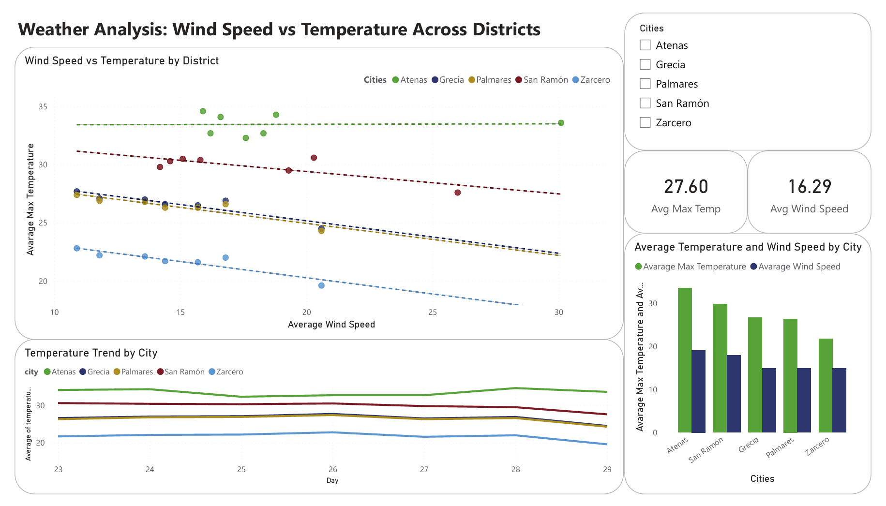

# 🌦️ Weather Data Pipeline

## 📌 Overview

This project implements an end-to-end data pipeline that extracts,
transforms, and loads (ETL) daily weather data using Python and SQL
Server.

The pipeline retrieves data from a public weather API for selected
districts in Alajuela, Costa Rica, processes it, and stores it in a
relational database for further analysis and visualization.

------------------------------------------------------------------------

## 📊 Dashboard Preview

This dashboard was built in Power BI to analyze the relationship between wind speed and temperature across districts.



------------------------------------------------------------------------


## 📈 Key Insights

- A negative relationship between wind speed and temperature was observed in most districts
- Atenas showed little to no correlation between these variables
- Higher wind speeds tend to be associated with slightly lower temperatures


------------------------------------------------------------------------


## 🎯 Objectives

-   Build a modular ETL pipeline using Python\
-   Integrate external API data into a structured database\
-   Design a relational schema for weather data\
-   Ensure data quality through validation and duplicate handling

------------------------------------------------------------------------

## 🛠️ Technologies Used

-   Python
-   pandas
-   requests
-   SQL Server
-   SQLAlchemy
-   pyodbc

------------------------------------------------------------------------

## ⚙️ Pipeline Architecture

API → Extract → Transform → Load → SQL Server

------------------------------------------------------------------------

## 📂 Project Structure

``` bash
.
├── extract.py     # Extracts weather data from API
├── transform.py   # Transforms JSON into structured DataFrames
├── load.py        # Loads data into SQL Server
├── db.py          # Manages database connection and validation
└── main.py        # Orchestrates the ETL pipeline
```

------------------------------------------------------------------------

## 🗄️ Data Model

### districts

| Column        | Description            |
|---------------|------------------------|
| ID_Districts  | Primary key            |
| city          | District name          |
| latitude      | Geographic coordinate  |
| longitude     | Geographic coordinate  |

---

### weather_data

| Column           | Description              |
|------------------|--------------------------|
| time             | Timestamp of observation |
| temperature_max  | Maximum temperature      |
| temperature_min  | Minimum temperature      |
| wind_speed_max   | Maximum wind speed       |
| ID_Districts     | Foreign key              |

------------------------------------------------------------------------

## 🚀 Key Features

-   Automated data extraction from a public API\
-   JSON processing and transformation using pandas\
-   Structured storage in SQL Server\
-   Duplicate prevention using pandas and SQL constraints\
-   Validation logic to prevent reloading static district data

------------------------------------------------------------------------

## 🔮 Future Improvements

-   Integration with Power BI for advanced visualization\
-   Pipeline scheduling (cron or Airflow)\
-   Enhanced logging and monitoring\
-   Error handling and retry mechanisms

------------------------------------------------------------------------

## 👨‍💻 Author

Edwin Vásquez Vargas\
Electrical Engineer | Data Analyst | ETL Pipelines & Power BI
